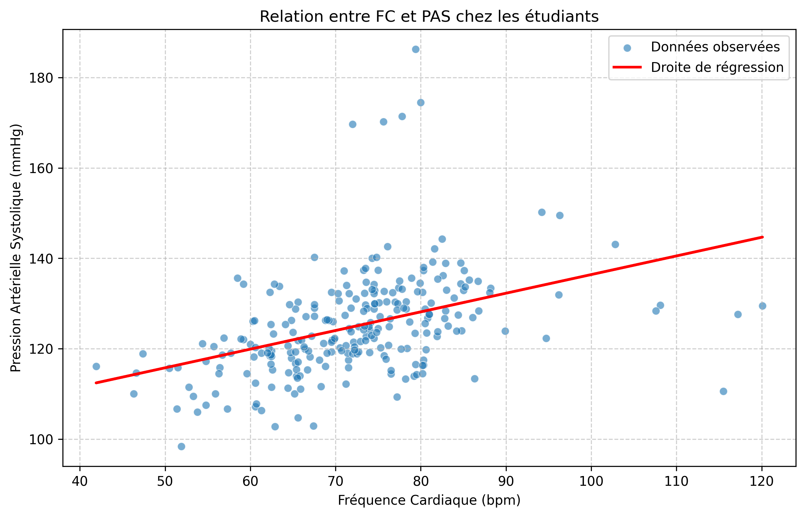
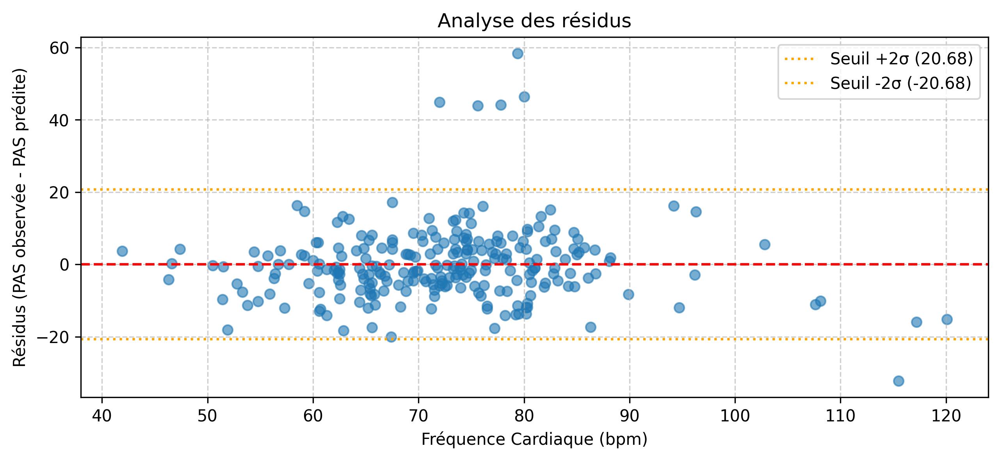

# RAPPORT_Q2: SANTE UNIVERSITAIRE
Redige par: Albert
Et analyse par: Emmanuel

---

## 1. Introduction
Ce rapport présente l'analyse des données de santé universitaire, en se concentrant sur la modélisation linéaire entre la Fréquence Cardiaque (FC) et la Pression Artérielle Systolique (PAS).

---

## 2. RESULTATS DE LA MODELISATION LINEAIRE

### 2.1. Analyse de la Correlation
Le coefficient de la Correlation de Pearson obtenu est **r = 0,4135**.

**Interpretation :** Il existe une correlation positive moderee. Lorsque la FC augmente, la PAS augmente egalement en tendance, mais le lien lineaire n'est pas tres fort.

### 2.2. Equation de la droite de regression
La formule mathematique permettant d'estimer la PAS en fonction de la FC est :

**PAS = 0,4126 * FC + 95,1374**

Ci-dessous le graphique du nuage de points incluant la droite de regression :

---

## 3. FIABILITE ET LIMITES DU MODELE

### 3.1. Qualites de la prediction (RxR)
Le coefficient de determination est :
**R2 = 0,1710** (soit **17,1 %**).

**Interpretation :** Seulement 17 % de la variance de la PAS est expliquée par la FC, les 83 % restants dependent d'autres facteurs.

### 3.2. Analyse des residus
Ci-dessous le graphique de l'analyse des residus :

---

## 4. CONCLUSION
En conclusion, bien qu'il existe une relation linéaire statistiquement significative entre la fréquence cardiaque et la pression artérielle systolique, la faible valeur du coefficient de détermination (R2 = 17,1 %) montre que la fréquence cardiaque seule ne suffit pas pour prédire précisément la PAS. D'autres variables cliniques devront être intégrées pour améliorer le modèle de prédiction.